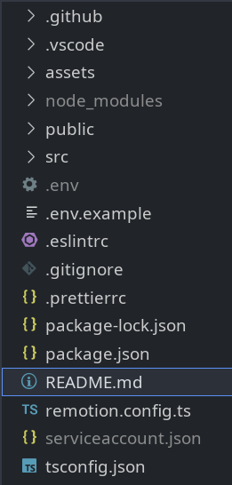

# Remotion Text-to-Speech Template

## Uses Google Cloud Platform + Firebase Storage

### **_NOTE:_** This is WIP, and **NOT** an official template yet, so do not use it in production.

### Feel free to try out and experiment with it. Report bugs and issues if you encounter.

<p align="center">
  <a href="https://github.com/remotion-dev/logo">
    <picture>
      <source media="(prefers-color-scheme: dark)" srcset="https://github.com/remotion-dev/logo/raw/main/animated-logo-banner-dark.gif">
      
    </picture>
  </a>
</p>

## Things to keep in mind:

1. As text for TTS changes, you may also want to programatically alter the `durationInFrames` for your `<Composition/>` using [`getAudioDurationInSeconds()`](https://www.remotion.dev/docs/get-audio-duration-in-seconds).

2. [Special consideration must be made](#running-on-cloud-development-environments) when using cloud development services (like GitHub Codespaces, StackBlitz, etc).

## Get Started

### 1. Create a Firebase Project


  
<!--  -->

### 2. Register your app in Firebase

- Go to Project Settings → "General" tab.
- Scroll down to "Your apps" section, and register a "Web App".

https://user-images.githubusercontent.com/38887390/233016949-b38d3644-cfeb-48be-938c-41574cbae0c4.mp4

<!-- VIDEO /assets/firebase-register.mp4 -->

- Copy the config credentials and paste into `.env`

### 3. Enable storage, create storage bucket with your preffered location.

https://user-images.githubusercontent.com/38887390/233017269-ed1812aa-d0f1-4d3a-907c-4b473cc6894e.mp4

<!-- VIDEO /assets/firebase-storage-enable.mp4 -->

### 4. Setup security rules

Edit rules to allow read, write for `remotion-gtts` directory (or any other directory that you have specified for `audioDirectoryInBucket` in the `constants.ts` file).

<!--  -->

- Configure bucket rules, such as the following:

```js
  rules_version = '2';
  service firebase.storage {
    match /b/{bucket}/o {
      match /remotion-gtts/{allPaths=**} {
        allow read, write: if true;
      }
    }
  }
```

> For production use, it is recommended to implement more rigorous validation measures to enhance security, especially for write operations.


### 5. Enable Text-to-Speech API on Google Cloud

You may already have a matching project set up in Google Cloud Platform (GCP) with the same name as your Firebase project. Use that project, as it simplifies the authentication setup.

- Open the hambuger menu, go to APIs and Services → Library.
- Search for "**text to speech**", and enable **Cloud Text-to-Speech API**.

  You may be required to enable billing, by creating a billing account. (Be sure to also review the pricing tab)

  <!--  -->
  

https://user-images.githubusercontent.com/38887390/233017359-daadcd50-bd5b-42bb-81a4-dd8cfca48a79.mp4

<!-- VIDEO /assets/gcp-enable-api.mp4 -->

### 6. Create Credentials

- After API is enabled, go to **Manage** → **Credentials** (on sidebar)

  
  <!--  -->

- Click **CREATE CREDENTIALS** and select **Service Account**.

  

<!--  -->

- Fill relevant fields, select the _Basic_ role of **_Owner_**, and skip the other optional fields if not required.

https://user-images.githubusercontent.com/38887390/233017468-8defa322-b79a-4ad8-9d04-e5b8c2bd26b8.mp4

<!-- VIDEO /assets/gcp-create-serviceaccount.mp4 -->

- Select the newly created Service Account, and create a JSON key to download credentials as a `.json` file.

https://user-images.githubusercontent.com/38887390/233017530-9bf8aeef-ff45-4e5a-8886-13a1dba2608a.mp4

<!-- VIDEO /assets/gcp-create-key.mp4  -->

- Place the downloaded JSON file in the root of your project, and rename it as `serviceaccount.json`.

  

> **IMPORTANT:** This file must never be committed, and must be added to .gitignore, .dockerignore, etc. if you change its name to something different.

> If you change the location of this file, make sure to also update `GOOGLE_APPLICATION_CREDENTIALS` in `.env`

## Example

Here's a sample video rendered using this template. _(Be sure to unmute the player)_

https://user-images.githubusercontent.com/38887390/232199560-d275def7-d147-4f29-acc6-5a81d267ba68.mp4

## Commands

#### Install Dependencies

```console
npm i
```

#### Start Preview

```console
npm start
```

#### Running on Cloud development environments:

- To run Remotion Preview or Renders, you need to set the server visibility to public, every time the server starts.
  This is not recommended and must only be used in trusted environments.

##### GitHub Codespaces:

```console
gh codespace ports visibility 5050:public -c $CODESPACE_NAME
```

Replace **5050** with your own port, if you have changed it to something else.

To avoid having to run the command every single time, you can forward the port in advance, so that it's still being forwarded after the server exits.

- Then reload the VS Code window by pressing <kbd>Ctrl</kbd> + <kbd>Shift</kbd> + <kbd>P</kbd> and selecting **Developer: Reload Window**

#### Render video

```console
npm run build
```

See [docs for server-side rendering](https://www.remotion.dev/docs/ssr) here.

#### Upgrade Remotion

```console
npm run upgrade
```

## Docs

Get started with Remotion by reading the [fundamentals page](https://www.remotion.dev/docs/the-fundamentals).

## Issues

Found an issue with Remotion? [File an issue here](https://github.com/JonnyBurger/remotion/issues/new).

## License

Notice that for some entities a company license is needed. Read [the terms here](https://github.com/JonnyBurger/remotion/blob/main/LICENSE.md).
